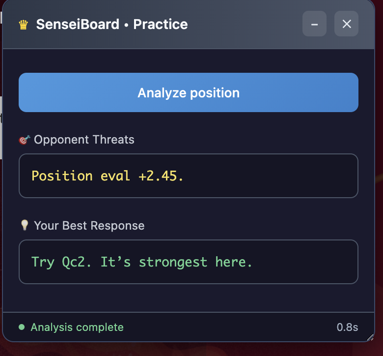
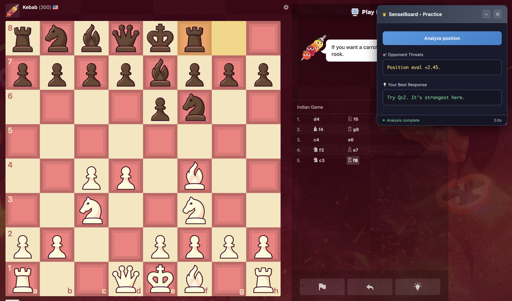

# ♟️ SenseiBoard • Practice



**SenseiBoard** is a Chrome extension overlay for [chess.com](https://www.chess.com) that automatically grabs the current chess position (FEN) from your active game and provides quick, LLM-powered analysis directly on the board.

## ✨ Features
- **Auto Grab Position** – One click to detect the current game state from your board.
- **Instant AI Analysis** – Explains threats and suggests your next move.
- **Overlay UI** – Displays analysis directly on the page without leaving the game.
- **Clean & Minimal** – No distracting options or settings — just play and learn.

## 📷 Preview
  

## 🚀 Setup Instructions

### Prerequisites
- Python 3.8+
- Stockfish chess engine
- Google Chrome browser

### Backend Setup
```bash
# Clone and navigate
git clone https://github.com/Sakshamyadav19/Chess-Sensei.git
cd Chess-Sensei

# Setup Python environment
python3 -m venv venv
source venv/bin/activate
pip install -r requirements.txt

# Install Stockfish
brew install stockfish  # macOS
# sudo apt-get install stockfish  # Ubuntu/Debian

# Optional: Create .env for Google AI (enhanced analysis)
echo "GOOGLE_API_KEY=your_key_here" > .env
# Get your API key from: https://aistudio.google.com/apikey

# Start the server
source .env  # Load environment variables
python3 app.py
```

### Extension Setup
1. Open Chrome → `chrome://extensions/`
2. Enable **Developer Mode**
3. Click **Load unpacked** → Select the `extension` folder
4. Visit [chess.com](https://www.chess.com) or [lichess.org](https://lichess.org) and start a game.
5. Click **Analyze position** to see the analysis.

## 🛠 How It Works
- **Backend**: Flask server with Stockfish engine integration and LlamaIndex RAG
- **Frontend**: Chrome extension that injects analysis overlay into chess websites
- **Analysis Pipeline**: Combines engine evaluation, threat detection, and pattern recognition
- **Real-time**: Automatically detects position changes and provides instant feedback

## 🐛 Troubleshooting

- **Stockfish not found**: Run `which stockfish` to verify installation
- **Extension not loading**: Check server is running at `http://127.0.0.1:8000`
- **No analysis**: Ensure venv is activated and run `source .env` before starting
- **LLM not working**: Add valid `GOOGLE_API_KEY` to `.env` file

## 💻 Development

### Quick Start for Developers
```bash
# Clone and setup
git clone https://github.com/muleyashutosh/Chess-Sensei.git
cd Chess-Sensei

# Setup Python environment
python3 -m venv venv
source venv/bin/activate
pip install -r requirements.txt

# Install Stockfish
brew install stockfish  # macOS

# Create minimal .env (optional)
echo "GOOGLE_API_KEY=your_key_here" > .env

# Start development server
python3 app.py
```

### Project Structure
```
Chess-Sensei/
├── app.py                 # Main Flask application
├── rag_support.py         # RAG and pattern recognition
├── gemini_support.py      # Google AI integration
├── corpus/motifs/         # Chess pattern database
├── extension/             # Chrome extension files
│   ├── content.js         # Injection script
│   ├── worker.js          # Background service worker
│   └── manifest.json      # Extension manifest
├── venv/                  # Python virtual environment
└── requirements.txt       # Python dependencies
```

### API Endpoints
- `GET /api/health` - Check if engine is ready
- `POST /api/analyze` - Analyze chess position (accepts FEN)

### Contributing
1. Fork the repository
2. Create a feature branch (`git checkout -b feature/amazing-feature`)
3. Commit your changes (`git commit -m 'Add amazing feature'`)
4. Push to the branch (`git push origin feature/amazing-feature`)
5. Open a Pull Request
